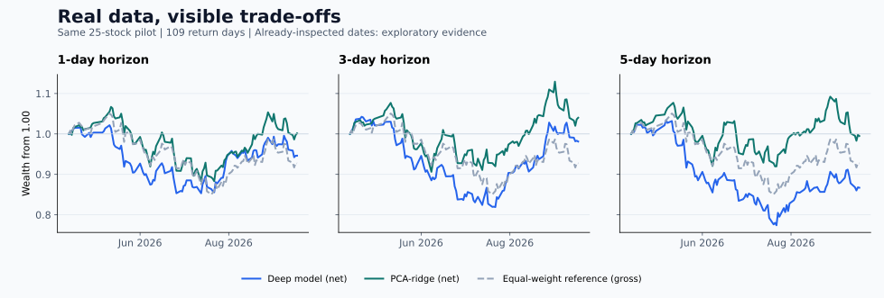

# VCStockRank

**简体中文** | [English](README.en.md)

A 股横截面排序研究工作台：真实行情、GPU 深度模型、多元统计基线、可重放回测，以及中英文界面。

**两个研究版本**：隔日版（1 个交易日）与波段版（3 / 5 个交易日），真实结果与演示均可切换。这里的“隔日”指日线收盘到下一收盘的研究模拟，不是分钟级日内或纯隔夜跳空交易；原来的 5 日模型也不属于长线模型。

[演示导览](docs/DEMO.md) · [算法与数学说明](docs/ALGORITHMS.md) · [科学抽样](docs/SAMPLING.md) · [真实结果分析](docs/EXPERIMENT_ANALYSIS.md)



上图由已提交的真实收益文件生成；合成演示另在工作台选择。蓝色为深度模型净值，绿色为统计模型净值，虚线参考未扣费。

## 快速体验

Python 3.11 / 3.12，进入项目目录：

```bash
python -m venv .venv
# Windows PowerShell
.venv\Scripts\Activate.ps1
# macOS / Linux: source .venv/bin/activate
python -m pip install -r requirements-ui.txt
python -m streamlit run app.py
```

打开 http://127.0.0.1:8501 。仅浏览演示和已提交报告无需 PyTorch。

1. 左侧 **语言 / Language** 切换中英文；本页顶部链接切换 README。
2. **研究概览**切换隔日版 / 波段版，再选择真实实验、上传 CSV 或合成演示。
3. 查看净值、回撤、月度表现、费用拖累、训练曲线、IC 与改进建议；下载收益及报告。
4. **版本对照**查看 1 / 3 / 5 日实跑，以及相同数据上的深度模型与统计模型对照。
5. **开始研究**显示统计目标、机器容量预算、实际计划抽样数与精度缺口，再运行训练；完成后可一键拟合 PCA 岭回归对照。

演示使用固定随机种子，明确标为合成数据，不能代表真实模型收益。CSV 上传格式为 `date,return`，收益用扣费后的小数值，例如 `0.01` 为 1%；拒绝重复日期、空数据与非有限值。股票名称、原始日志和部分实验字段保留原文。

## 扩大样本的隔日实跑

已按种子 42 从 4,992 只合格股票中随机抽取 **227 只**，其中 **225 只**取得足够行情，共 **160,526 条**记录。`sz.001369`、`sh.603407` 未取得足够长度的可用数据，保留缺失记录，不替换。GPU 完整训练 20 轮，最佳第 16 轮；重放核对 24,750 行预测与 109 日收益。

| 相同 225 只股票 / 1 日周期 | 扣费净收益 | 最大回撤幅度 | 费用拖累（百分点） |
| --- | ---: | ---: | ---: |
| [深度模型](reports/20260919-002021-54513a/summary.json) | −14.57% | 29.33% | 11.32 |
| [PCA 岭回归](reports/statistical-scientific-20260919-1d/summary.json) | −0.27% | 34.13% | 12.60 |
| [PCA 岭回归 + 验证集选择的排名缓冲](reports/statistical-buffered-scientific-20260919-1d/summary.json) | **+6.53%** | **29.80%** | 5.51 |

缓冲从 0 / 5 / 10 / 20 中仅按验证净收益选出 **20**；平均双边换手从 72.73% 降到 30.85%。这是探索性改善，**回撤仍接近 30%，尚无稳定收益证据**；日均收益差的区块区间仍包含零。该版本的构思发生在查看先前成本诊断之后，不能把这段测试期当作独立新验证。完整限制与对照见[分析报告](docs/EXPERIMENT_ANALYSIS.md)。

## 真实实验：不隐藏负收益

2026-09-19（北京时间）完成三个协议 v4 的 GPU 实验及三个统计基线，并通过保存模型的独立重放。共同数据为 BaoStock 前复权日线，2023-09-18 至 2026-09-17，25 只试点股票、727 个交易日、18,175 条记录；收益评估为 2026-04-14 至 2026-09-17 共 109 日。

| 方法 | 1 日净收益 | 3 日净收益 | 5 日净收益 |
| --- | ---: | ---: | ---: |
| VCformer-TPA 深度模型 | −5.38% | −1.88% | −13.31% |
| PCA 岭回归 + 历史 EWMA 风险 | +0.15% | +4.01% | −0.52% |
| 同股票池每日等权参考（未扣费） | −7.30% | −7.30% | −7.30% |

这些是**探索性结果**：股票池是旧流程前 25 只，测试区间已被反复查看，只有一个随机种子。不能按此表选模型后再宣称同一区间是独立最终验证。统计模型的平均日收益差区块区间包含零，尚不能认定稳定优势。收益、成本、回撤、分月 IC 和解释见[结果分析](docs/EXPERIMENT_ANALYSIS.md)。

[1 日深度模型](reports/shortline-20260919-1d/summary.json) · [3 日深度模型](reports/shortline-20260919-3d/summary.json) · [5 日深度模型](reports/shortline-20260919-5d/summary.json) · [1 日统计模型](reports/statistical-shortline-20260919-1d/summary.json) · [3 日统计模型](reports/statistical-shortline-20260919-3d/summary.json) · [5 日统计模型](reports/statistical-shortline-20260919-5d/summary.json)

旧协议 v3 的 −1.88% 实验单独保留在 [real-20260918](reports/real-20260918/summary.json)。v4 将风险标签改为对应未来周期日收益的均方根，使 1 日目标有效；不能把 v3 与 v4 当成只有持有期不同的严格对照。

## 模型与科学抽样

- **深度模型**：51 维因果特征、30 日历史窗口、按日期成组排序、未来风险辅助任务，CUDA 可用时自动使用 GPU。
- **统计模型**：历史末值 / 均值 / 标准差形成 153 维输入；训练集标准化与 PCA 保留 95% 特征方差；SVD 岭回归缓解共线性，惩罚系数仅用验证 IC 选择。风险采用历史 EWMA；时间不确定性采用区块自助法。详见[数学公式和边界](docs/ALGORITHMS.md)。
- **新实验抽样**：固定种子无放回随机抽样，数量为统计需求与可调容量预算的较小值。默认 95% 置信、比例误差 ±5 个百分点、未知比例 50%；4,992 只合格池要求 357 只。本次预算 227 只对应约 ±6.36 个百分点，未达到目标精度。该公式用于股票池比例规划，**不是收益置信保证**。

## 真实训练与复现

```bash
python -m pip install -r requirements.txt -r requirements-ui.txt
python run_experiment.py --start 2023-09-18 --end 2026-09-17 --horizon 1 --stocks 227 --epochs 20 --seed 42
python verify_experiment.py runs/<experiment-id>
# Same downloaded data and splits, train-only PCA and validation-selected ridge
python compare_models.py runs/<experiment-id>
python compare_models.py runs/statistical-<experiment-id> --verify
# Reproduce the matched pilot comparison (legacy first-25 pool)
python compare_horizons.py --start 2023-09-18 --end 2026-09-17 --stocks 25 --epochs 20 --name shortline-my-run
```

省略 `--stocks` 时自动估计容量；`--stocks` 为预算上限，最终数量还受统计目标限制。可用 `--sampling legacy` 复现前 N 只流程。每次建立独立 `runs/`，保存设置、抽样快照、行情、模型、日志和报告；不自动复用旧模型。新下载数据可能因复权更新与源修订而不同，精确重放应使用原快照。

新检查点冻结全部模型默认值与组合参数，并在实验开始记录源码哈希。旧对象式检查点重放时需要原始 `summary.json`，防止后续代码默认值改变历史实验设置。

本机实跑使用 RTX 3060 12GB 与 PyTorch 2.8.0+cu126；CUDA 不可用时使用 CPU，统计矩阵拟合使用 CPU。安装与驱动匹配的 PyTorch 请参考[官方说明](https://pytorch.org/get-started/locally/)。关闭网页不停止后台任务；停止按钮只控制当前会话启动的任务。默认监听本机 127.0.0.1，仅供本机单用户使用。

## 评估约定

70% / 15% / 15% 时间切分，两个边界统一禁入 5 个交易日。历史输入截止目标日前一日；不从未来回填。深度模型由验证损失早停选优，统计模型由验证 IC 选惩罚。测试结果不参与这些自动选择，但已查看的测试期不能再作为新假设的独立验收。

预测和调仓周期对应 1 / 3 / 5 日。默认前 10 只、单股上限 10%，满仓权重受到等权约束；不能把算法间收益差单独归因于风险估计。权重随价格漂移，买卖双向收取 0.1% 成本和 0.05% 滑点，初始建仓收费，末日不调仓。最大回撤含初始本金。IC 使用对应未来周期标签；分层收益采用非重叠周期。参考为同池每日等权毛收益，**不是沪深 300**。

## 结构与验证

```text
app.py / ui/                双语工作台、版本切换、对照与结果分析
research/pipeline.py        深度模型训练流程
research/statistical.py     PCA、SVD 岭回归、EWMA、区块区间
research/sampling.py        抽样框、统计样本量与容量预算
research/analysis.py        月度收益、回撤、成本与训练诊断
research/experiments.py     独立任务与持久化状态
research/reporting.py       结果、来源、环境和文件哈希
data/ / training/ / model/  下载、因果标签、特征与深度模型
portfolio/ / evaluation/    统一持仓模拟、成本与评估
reports/ / docs/            轻量真实证据、演示和方法说明
runs/                      本地行情、特征、检查点（不提交）
tests/                     时间隔离、矩阵算法、抽样、回测与双语界面
```

Python 注释与 docstring 使用英文。核心、界面及可选分析依赖分开安装；Windows 与 Linux CI 运行同一测试集。

```bash
python -m pip install -r requirements-dev.txt
python -m pytest -q
```

## 局限

当前股票池和下载时前复权存在时点与幸存者偏差；随机抽样不会消除它们。未模拟涨跌停、停牌成交约束、税费差异和真实执行延迟。尚未完成多时间窗口、多种子的独立稳定性确认。本项目是可审计的研究原型，不是实盘系统或收益承诺。

[MIT License](LICENSE) · [@ilovemiku520](https://github.com/ilovemiku520)
